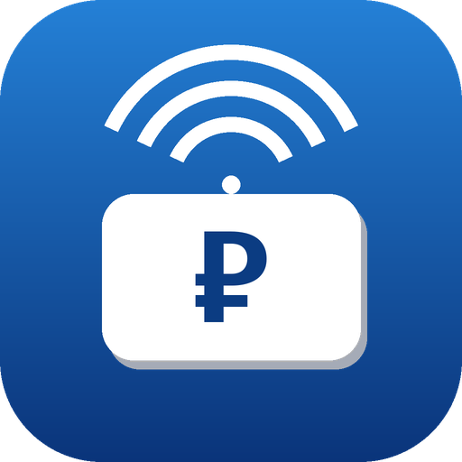

<p align="center">
  
</p>

# Транспондер (ЗСД / Автодор) для Home Assistant

[](https://github.com/hacs/integration)
[](https://github.com/XroMSPb/ha-transponder/releases)
[](LICENSE)
[](https://github.com/XroMSPb/ha-transponder)

Пользовательская интеграция для Home Assistant, которая показывает баланс личного
кабинета транспондеров платных дорог в виде сенсоров. Одна интеграция —
несколько операторов, каждый добавляется отдельной записью.

**Поддерживаемые операторы:**

- 🟢 **ЗСД — Магистраль Северной Столицы** (`cabinet.nch-spb.com`, Onyma xRM)
- 🟢 **Автодор — Платные дороги** (`lk.avtodor-tr.ru`, T-pass, Keycloak)

---

## Возможности

- Сенсор баланса на каждый договор (`device_class: monetary`, валюта `RUB`).
- Для Автодора — дополнительный сенсор **бонусных баллов**.
- Атрибуты: оператор, номер договора, лицевой счёт, статус, число транспондеров,
  время актуальности данных.
- Настройка через UI: сначала выбор оператора, затем логин/пароль.
- Повторная авторизация (reauth) при смене пароля или истечении сессии.
- Настраиваемый интервал опроса (по умолчанию 30 мин, минимум 5).
- Ускоренные повторы при сбое: если обновление не удалось, опрос идёт раз
  в 3 минуты (до 5 раз ≈ 15 минут), затем возвращается к обычному интервалу.
- Русский и английский интерфейс.

---

## Как это работает

Ни у одного из кабинетов нет публичного API, поэтому интеграция повторяет
действия браузера, у каждого оператора — свой способ входа.

**ЗСД (Onyma):**
1. `POST /onyma/` с логином/паролем → cookie сессии.
2. `POST /onyma/system/literpc/`, RPC-пакет `toll-balance-refresher` → HTML с
   балансом по всем договорам.

**Автодор (Keycloak + Spring BFF):**
1. `GET /` → редирект на страницу входа Keycloak (realm `avtodor`, клиент `lkmp`).
2. `POST …/login-actions/authenticate` с логином/паролем → возврат на
   `/sso/login?code=…`, сервер меняет код на токен и ставит HttpOnly-cookie `SESSION`.
3. `GET /api/client/extended` → JSON с балансом, бонусами и договорами.

`iot_class: cloud_polling`. Пожалуйста, не ставьте слишком короткий интервал —
запросы идут на реальные серверы личных кабинетов.

---

## Установка

### Через HACS (рекомендуется)

1. HACS → ⋮ (меню) → **Пользовательские репозитории** (Custom repositories).
2. Добавьте URL этого репозитория, категория — **Integration**.
3. Установите **Транспондер (ЗСД / Автодор)** и перезапустите Home Assistant.

[](https://my.home-assistant.io/redirect/hacs_repository/?owner=XroMSPb&repository=ha-transponder&category=integration)

### Вручную

Скопируйте папку `custom_components/transponder/` в каталог
`config/custom_components/` вашего Home Assistant и перезапустите его.

---

## Настройка

**Настройки → Устройства и службы → Добавить интеграцию → «Транспондер».**

1. Выберите оператора (ЗСД или Автодор).
2. Введите логин и пароль от личного кабинета:
   - **ЗСД** — логин с [cabinet.nch-spb.com](https://cabinet.nch-spb.com);
   - **Автодор** — email или телефон с [lk.avtodor-tr.ru](https://lk.avtodor-tr.ru).

Чтобы добавить оба кабинета — добавьте интеграцию дважды. Учётные данные
хранятся в записи конфигурации Home Assistant и отправляются только на сервер
соответствующего оператора.

Интервал опроса меняется через кнопку **Настроить** (Options).

### Сущности

Один сенсор баланса на договор (у Автодора ещё сенсор бонусов):

| Параметр       | ЗСД             | Автодор              |
|----------------|-----------------|----------------------|
| Состояние      | `716.25` (RUB)  | `898.85` (RUB)       |
| `contract`     | `1234567-KT001` | `KT001`              |
| `account`      | —               | `123456`             |
| `status`       | `Активен`       | `Действителен`       |
| `transponders` | —               | `1`                  |
| Бонусы         | —               | сенсор `bonus`, `400`|

---

## Карточка на панель (Lovelace)

См. [`lovelace/transponder_card.yaml`](lovelace/transponder_card.yaml). Замените
`sensor.transponder_balance` на реальный `entity_id`.

Дополнительно — [`lovelace/mushroom_badge.yaml`](lovelace/mushroom_badge.yaml):
компактный [Mushroom](https://github.com/piitaya/lovelace-mushroom)-бейдж с
балансом и цветом иконки по порогам (зелёный / оранжевый / красный). Требует
установленных карт Mushroom. Учтите: цвет иконки у бейджа задаётся свойством
`color` (не `icon_color`), а условия в `if/elif` идут по возрастанию.

---

## Проверка перед установкой

Можно убедиться, что логин и парсер работают, не заходя в Home Assistant:

```bash
pip install aiohttp
python tools/test_login.py --provider zsd     --username ВАШ_ЛОГИН
python tools/test_login.py --provider avtodor --username ВАШ_EMAIL_ИЛИ_ТЕЛЕФОН
```

Скрипт запросит пароль (ничего не сохраняется) и выведет разобранный баланс.
Используется тот же код, что и в интеграции.

---

## Устранение неполадок

- **`invalid_auth`** — проверьте логин/пароль на сайте кабинета вручную.
  Запрос на повторную авторизацию теперь появляется только если сайт явно
  отклонил пароль. Временные сбои входа (истёкшая форма, анти-бот проверка,
  перегрузка сервера) больше не считаются неверным паролем — они попадают в
  ускоренные повторы, и данные восстанавливаются сами.
- **`cannot_connect`** — сайт недоступен или изменил ответ; повторите позже.
- Данные не обновляются — увеличьте интервал опроса; возможна временная
  блокировка частых запросов на стороне сервера. После неудачного обновления
  интеграция сама какое-то время опрашивает чаще (раз в 3 минуты, до 5 раз),
  поэтому баланс обычно восстанавливается без ручного вмешательства.

---

## Иконка

Иконка (`icons/`) — оригинальная графика, сгенерирована скриптом
[`tools/make_icon.py`](tools/make_icon.py). Чтобы иконка отображалась в самом
Home Assistant, файлы `icon.png` (256×256) и `icon@2x.png` (512×512) нужно
отправить PR'ом в репозиторий
[home-assistant/brands](https://github.com/home-assistant/brands) в каталог
`custom_integrations/transponder/`.

---

## Отказ от ответственности

Неофициальная интеграция. Не связана с ЗСД / Магистраль Северной Столицы / Onyma
и с Автодор / Автодор — Платные Дороги. Кабинеты указывают, что данные о балансе
носят справочный характер. Используйте на свой риск: разметка или процесс входа
на сайтах могут измениться и сломать интеграцию.

---

## Лицензия

[MIT](LICENSE)
